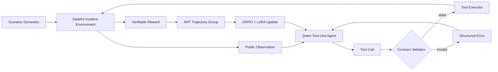

# AgentTool-RL

**A verifiable training environment for multi-turn tool-use agents.**

[](https://github.com/Sh1Rana1/AgentTool-RL/actions/workflows/ci.yml)
[](https://www.python.org/)
[](LICENSE)
[](https://github.com/Sh1Rana1/AgentTool-RL/tree/v0.1.0)

AgentTool-RL 将微服务故障诊断建模为一个可控、可复现的多轮工具调用任务：Agent 需要在有限调用预算内查询日志、指标、依赖关系与发布记录，引用真实获得的证据，并提交根因和处置方案。

项目的目标不是再做一个“能调用工具”的对话 Demo，而是回答一个更具体的问题：**程序化验证中间步骤，能否通过 GRPO 后训练提升小模型的参数生成、证据一致性与错误恢复能力？**

> 当前里程碑：**v0.1.0** 已完成工具契约、场景协议、示例数据、静态验证器和 CI。可执行环境、Reward 与 OpenPipe ART 训练闭环将按路线图逐步接入。

## 为什么做这个项目

真实 Agent 的失败往往不发生在最终回答，而发生在执行链路中：

- 工具名正确，但服务名、时间窗口或枚举参数不可执行；
- 最终结论看似合理，但引用了本轮对话中从未获得的证据；
- 工具返回结构化错误后，模型重复同一调用或直接放弃；
- 只使用终局成功奖励，无法区分“调查路径正确但最后一步失败”和“全程猜测”。

AgentTool-RL 为这些行为提供可机器验证的状态与反馈，使训练信号能够覆盖完整 trajectory，而不仅是最后一条回复。

## 核心设计

| 设计 | 实现方式 | 希望解决的问题 |
| --- | --- | --- |
| 有状态诊断环境 | 每个 episode 保存告警、服务拓扑、日志、指标、发布记录和调用预算 | 将工具调用变成连续决策，而非独立问答 |
| 分层参数校验 | Schema、取值、跨轮引用和业务语义四层校验 | 区分 JSON 合法与调用真正可执行 |
| 可追踪证据 | 工具返回唯一 evidence ID，最终提交只能引用本轮已获得证据 | 防止证据幻觉与跨 episode 污染 |
| 可恢复错误 | 非法调用返回 `{error_type, message, recoverable}` | 训练模型根据反馈修正参数 |
| 可验证奖励 | 由隐藏状态和 trajectory 计算任务、证据、恢复与成本信号 | 避免人工标注和 LLM-as-a-Judge 的不稳定性 |
| 冻结评测集 | Train / validation / test ID 隔离，并保留未见参数组合 | 评估策略泛化而非模板记忆 |

## 系统架构



环境严格分离 public observation 与 hidden state。根因、必要证据和可接受处置只对环境与 Reward 可见，不进入模型上下文。完整的 episode 生命周期、数据隔离与奖励设计见 [`docs/architecture.md`](docs/architecture.md)。

## 一条典型的 Agent 轨迹

```text
用户告警
  → query_metrics(service, metric, time_window)
  → 参数错误：未知 metric，可恢复
  → 修正参数并重新查询
  → query_logs(...) / get_recent_deployments(...)
  → 获得 evidence IDs
  → submit_diagnosis(root_cause, evidence_ids, mitigation)
  → 环境依据隐藏真值与完整轨迹评分
```

这条轨迹可以同时回答：任务是否完成、参数是否合法、证据是否真实获得、错误是否被修正，以及完成任务消耗了多少次调用。

## 当前实现：v0.1.0

- 定义 5 个版本化工具契约：`query_logs`、`query_metrics`、`get_dependencies`、`get_recent_deployments`、`submit_diagnosis`；
- 提供 deployment regression、连接池耗尽、缓存不可用、上游超时和证书过期 5 类示例故障；
- 为每个场景分离公开告警、隐藏根因、必要证据、可接受处置和期望调查路径；
- 实现场景静态验证，检查字段完整性、根因枚举、工具引用、任务 ID 唯一性和终止动作；
- 使用单元测试验证工具 Schema 可序列化、禁止额外参数，并检查隐藏答案不会直接泄漏到用户请求；
- GitHub Actions 在 Python 3.11 / 3.12 上自动执行数据验证和测试。

## 快速开始

当前版本无第三方运行时依赖：

```bash
git clone https://github.com/Sh1Rana1/AgentTool-RL.git
cd AgentTool-RL
python scripts/validate_examples.py
python -m unittest discover -s tests -v
```

预期数据检查结果：

```text
Validated 5 scenarios and 5 tool contracts.
```

## 评测协议

后续版本将用同一套 evaluator 比较 Random、Rule-based、Base LLM 与 GRPO Agent，避免不同方法使用不同成功标准。

| 指标 | 关注的能力 |
| --- | --- |
| Task Success Rate | 在预算内完成正确诊断与处置 |
| Schema Valid Rate | 生成满足工具契约的参数 |
| Semantic Argument Accuracy | 服务、指标和时间范围符合环境约束 |
| Evidence Validity | 最终引用来自本轮真实工具结果 |
| Error Recovery Rate | 首次失败后能否利用反馈修正调用 |
| Average Tool Calls | 完成任务的交互成本 |

## Roadmap

| 版本 | 关键交付 | 状态 |
| --- | --- | --- |
| v0.1 | 工具契约、场景协议、示例数据、验证器与 CI | **Completed** |
| v0.2 | 有状态环境、工具执行器、程序化 Reward 与数据生成器 | Planned |
| v0.3 | Random / Rule-based / Base LLM baseline 与统一 evaluator | Planned |
| v0.4 | OpenPipe ART 多轮 trajectory 与并发 rollout | Planned |
| v0.5 | Qwen2.5 + LoRA 的 GRPO smoke test、checkpoint 保存与重载 | Planned |
| v0.6 | 正式训练、奖励消融、泛化评测与失败分析 | Planned |

## 仓库结构

```text
AgentTool-RL/
├── data/examples/          # 人工审阅的代表性故障场景
├── docs/                   # 架构、状态隔离、奖励与评测协议
├── scripts/                # 数据验证入口
├── src/agenttool_rl/       # 工具契约与场景验证逻辑
└── tests/                  # 契约与数据一致性测试
```

## 技术栈与边界

计划训练栈为 **Python / PyTorch / OpenPipe ART / Qwen2.5 / GRPO / LoRA**。AgentTool-RL 自行实现环境、工具协议、场景生成、Reward 和评测逻辑，ART 用于 trajectory 采集与后训练编排。

项目采用 [Apache-2.0 License](LICENSE)。
