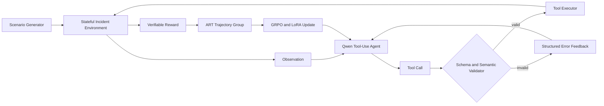

# AgentTool-RL

面向多轮工具调用的 Agent 强化学习实验。

> **Status: v0.1.0 — project scaffold and contracts.** 训练代码将在后续版本接入；当前版本不声称已经获得强化学习效果。

## 项目介绍

AgentTool-RL 研究大语言模型 Agent 在多轮工具调用中的三个常见问题：参数生成错误、跨步骤引用失效，以及收到工具错误后无法恢复。项目以微服务故障诊断为可控任务，构建带隐藏真实状态的模拟环境、可程序化验证的工具接口和确定性奖励，再基于 OpenPipe ART 接入同场景多轨迹采样、GRPO 后训练与 LoRA 更新。

项目的核心问题是：在终局任务成功之外加入参数、证据和错误恢复信号，能否让小模型学习到更可靠的工具使用策略？

## 目标与边界

- 训练对象是 Agent 的工具选择、参数生成和错误恢复策略。
- 环境负责生成确定性的日志、指标、依赖关系和发布记录。
- Reward 由隐藏状态和规则验证器计算，不依赖人工打分或 LLM-as-a-Judge。
- 测试集在训练前冻结，用于评估未见场景和未见参数组合。
- v0.1 只定义稳定契约与示例；可执行环境、Agent baseline 和 GRPO 训练按路线图逐步交付。

## 系统架构



完整设计见 [`docs/architecture.md`](docs/architecture.md)。

## 工具契约

| 工具 | 作用 | 关键校验 |
| --- | --- | --- |
| `query_logs` | 查询指定服务在时间窗口内的日志 | 服务、关键词、时间先后关系 |
| `query_metrics` | 查询服务指标 | 服务、指标枚举、时间窗口 |
| `get_dependencies` | 获取服务上下游依赖 | 服务存在性、依赖方向 |
| `get_recent_deployments` | 获取近期发布记录 | 服务存在性、起始时间 |
| `submit_diagnosis` | 提交根因、证据与缓解措施 | 根因枚举、证据来源、业务约束 |

机器可读契约位于 [`src/agenttool_rl/contracts.py`](src/agenttool_rl/contracts.py)。

## 示例场景

`data/examples/scenarios.jsonl` 提供五类代表性故障：

1. 发布版本回归；
2. 数据库连接池耗尽；
3. Redis 缓存不可用；
4. 上游服务超时；
5. TLS 证书过期。

每个场景包含用户请求、公开告警、隐藏根因、必要证据和期望工具路径。隐藏字段只供环境与奖励器使用，不会进入 Agent observation。

## 快速检查

当前版本无第三方运行时依赖。使用 Python 3.11 或更高版本：

```bash
python scripts/validate_examples.py
python -m unittest discover -s tests -v
```

预期输出：

```text
Validated 5 scenarios and 5 tool contracts.
```

## 计划评测指标

| 指标 | 含义 |
| --- | --- |
| Task Success Rate | 是否在预算内提交正确根因和缓解措施 |
| Tool Selection Accuracy | 当前状态下选择的工具是否合理 |
| Schema Valid Rate | 工具参数是否满足机器可读契约 |
| Semantic Argument Accuracy | 参数是否满足时间、服务和业务约束 |
| Error Recovery Rate | 首次调用失败后能否依据反馈完成修正 |
| Average Tool Calls | 完成任务的平均工具调用次数 |
| Invalid Call Rate | 非法或不可执行调用占比 |

## 版本路线

| Version | 交付内容 | 状态 |
| --- | --- | --- |
| v0.1 | 仓库骨架、工具契约、示例场景、架构与验证器 | **完成** |
| v0.2 | 有状态环境、工具执行器、程序化奖励、数据生成器 | 计划中 |
| v0.3 | 随机、规则和 Base LLM Agent baseline 与统一评测 | 计划中 |
| v0.4 | ART 多轮 trajectory、并发 rollout 与训练边界验证 | 计划中 |
| v0.5 | Qwen + LoRA 的 GRPO smoke test 与 checkpoint 闭环 | 计划中 |
| v0.6 | 正式训练、稀疏/稠密奖励对照与真实结果 | 计划中 |
| v0.7 | 消融实验、失败分析和交互 Demo | 计划中 |
| v1.0 | 可复现实验与面试发布版 | 计划中 |

## 仓库结构

```text
.
├── data/examples/          # 手工审阅的代表性场景
├── docs/                   # 架构、奖励与评测设计
├── scripts/                # 开发和数据检查入口
├── src/agenttool_rl/       # 工具契约与场景验证代码
└── tests/                  # 契约与数据一致性测试
```

## 开源与致谢

项目计划使用 [OpenPipe ART](https://github.com/OpenPipe/ART) 完成 Agent trajectory 采集与 GRPO 后训练。AgentTool-RL 自行实现环境、工具契约、场景、奖励和评测逻辑。项目采用 Apache-2.0 License。

