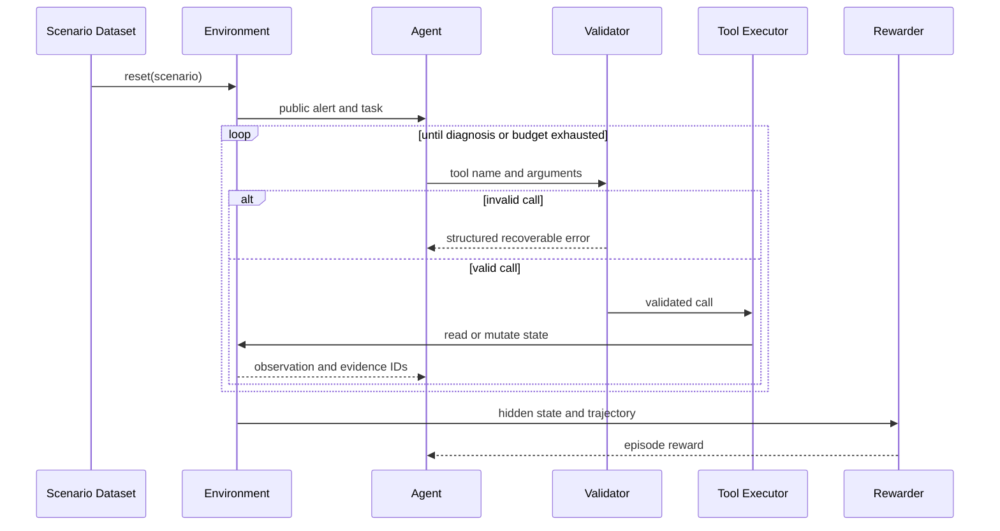

# Architecture and Experiment Contract

## Research question

Can verifiable intermediate feedback improve a small language model's ability to select tools, generate semantically valid arguments, and recover from execution errors in multi-turn tasks?

## Episode lifecycle

## State separation

The environment keeps public and hidden state separate. Public state contains the user request, alert summary, tool observations, and structured errors. Hidden state contains the canonical root cause, required evidence IDs, valid mitigations, and data used to answer tool calls. The hidden state must never be rendered into the model prompt.

## Validation layers

1. **Schema validation:** required fields, JSON types, arrays, and enums.
2. **Value validation:** known services, metrics, root causes, and ISO-8601 timestamps.
3. **Cross-turn validation:** submitted evidence IDs must have been returned earlier in the same episode.
4. **Semantic validation:** time windows, tool relevance, and incident-specific business constraints.

Errors are structured as `{error_type, message, recoverable}` so an agent can learn to repair a call rather than merely receive a negative terminal reward.

## Planned reward components

The exact coefficients will be frozen in v0.2 before training data is generated.

| Event | Direction | Purpose |
| --- | --- | --- |
| Correct final diagnosis | Positive | Optimize end-to-end task success |
| Required evidence collected | Positive | Reward grounded investigation |
| Semantically valid arguments | Positive | Improve tool reliability |
| Recovery after invalid call | Positive | Learn from environment feedback |
| Invalid or hallucinated parameter | Negative | Discourage non-executable actions |
| Unseen or stale evidence reference | Negative | Enforce cross-turn consistency |
| Redundant call | Negative | Control interaction cost |
| Unsupported diagnosis | Negative | Discourage guessing without evidence |

## Data split contract

- Train, validation, and test IDs are disjoint.
- Test scenarios are generated and frozen before training.
- Scenario templates may be shared across splits, while concrete services, timestamps, evidence IDs, and parameter combinations differ.
- A dedicated generalization split contains unseen combinations of known tool schemas.
- Every generation run records its seed and generator version.

## Version gates

Each release must be independently runnable and may only claim behavior demonstrated by that tag. Training-effect claims require v0.6 experiment artifacts; earlier releases may claim pipeline completion but not performance improvement.

